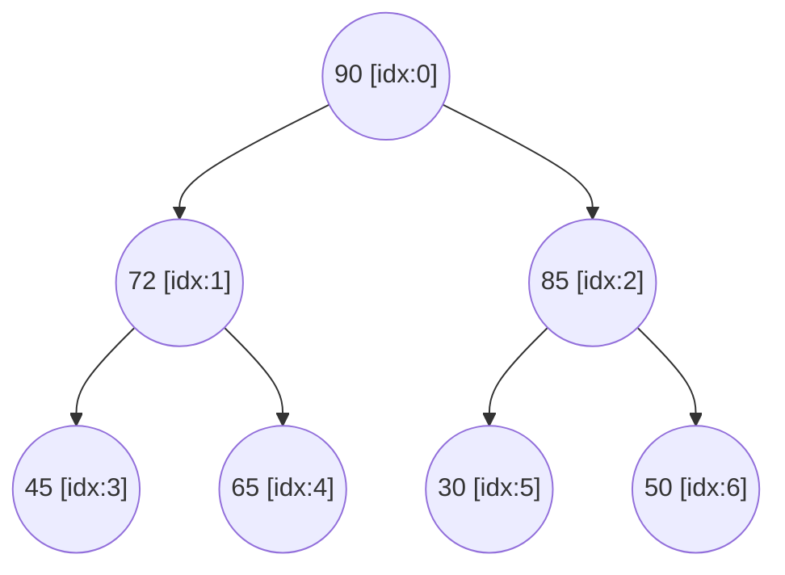

# 📝 Step-by-Step Triage Execution Trace Analysis

**Author:** Ajwel Janardhanan  
**Project:** Hospital Patient Priority Queue Benchmark  

This document details the exact array state transitions, tree structures, and metric counts across all execution steps for **Max Heap Insertion**, **Heap Sort**, and **Quick Sort**.

---

## 🌲 Part A: Max Heap Dynamic Insertion Traces

Each new patient score is added to the array index $n$ (`heap_count`) and sifted upward (bubble up) until parent score $\ge$ child score.

### Sequential Heap Insertion Table

| Step | Patient Score | Array State (`priority_heap`) | Action Taken |
| :---: | :---: | :--- | :--- |
| **1** | **45** | `[45]` | Inserted at root (index 0). |
| **2** | **72** | `[72, 45]` | Inserted at index 1; swapped with parent (45). |
| **3** | **30** | `[72, 45, 30]` | Inserted at index 2; parent (72) $\ge$ 30, no swap. |
| **4** | **90** | `[90, 72, 30, 45]` | Inserted at index 3; swapped with 45, then swapped with 72. |
| **5** | **65** | `[90, 72, 30, 45, 65]` | Inserted at index 4; swapped with parent (45). |
| **6** | **50** | `[90, 72, 50, 45, 65, 30]` | Inserted at index 5; swapped with parent (30). |
| **7** | **85** | `[90, 72, 85, 45, 65, 30, 50]` | Inserted at index 6; swapped with parent (30). |

---

### Final Max Heap Tree Representation

- **Tree Height ($h$):** $\lfloor \log_2 7 \rfloor = 2$ (3 levels: Root, Level 1, Level 2).
- **Highest Priority Patient:** `heap[0] = 90` (instantly accessible at root).
- **Operation Metrics:** **9 comparisons**, **5 swaps**.

---

## ⚡ Part B: Sorting Traces

### 1. Heap Sort Execution Traces

#### Phase I: Bottom-Up Heapification
Constructs a max heap from the array by running sift-down from sub-roots $\lfloor n/2 \rfloor - 1 = 2$ down to $0$:

| Sift-Down Sub-root Index | Array State After Sift-Down |
| :---: | :--- |
| **Index 2** | `[45, 72, 85, 90, 65, 50, 30]` |
| **Index 1** | `[45, 90, 85, 72, 65, 50, 30]` |
| **Index 0** | `[90, 72, 85, 45, 65, 50, 30]` |

*Heap build phase completed in **8 comparisons** and **4 swaps**.*

#### Phase II: Sequential Extraction & Heap Restoration
Exchanges root element with last active element, shrinks heap size, and runs `max_heapify(0)`:

| Step | Active Heap Prefix | Extracted Sorted Portion |
| :---: | :--- | :--- |
| **1** | `[85, 72, 50, 45, 65, 30]` | `[90]` |
| **2** | `[72, 65, 50, 45, 30]` | `[85, 90]` |
| **3** | `[65, 45, 50, 30]` | `[72, 85, 90]` |
| **4** | `[50, 45, 30]` | `[65, 72, 85, 90]` |
| **5** | `[45, 30]` | `[50, 65, 72, 85, 90]` |
| **6** | `[30]` | `[45, 50, 65, 72, 85, 90]` |

- **Final Sorted Output:** `[30, 45, 50, 65, 72, 85, 90]`
- **Total Heap Sort Metrics:** **21 comparisons**, **18 swaps**.

---

### 2. Quick Sort Execution Traces (Lomuto Partitioning)

Selects the rightmost element in subarray range `[low_idx..high_idx]` as pivot. Rearranges elements $\le \text{pivot}$ to left and elements $> \text{pivot}$ to right.

| Partition Step | Subarray Range | Pivot Element | Final Pivot Index | Array State After Partition |
| :---: | :---: | :---: | :---: | :--- |
| **1** | `0 to 6` | **85** | **5** | `[45, 72, 30, 65, 50, 85, 90]` |
| **2** | `0 to 4` | **50** | **2** | `[45, 30, 50, 65, 72, 85, 90]` |
| **3** | `0 to 1` | **30** | **0** | `[30, 45, 50, 65, 72, 85, 90]` |
| **4** | `3 to 4` | **72** | **4** | `[30, 45, 50, 65, 72, 85, 90]` |

- **Final Sorted Output:** `[30, 45, 50, 65, 72, 85, 90]`
- **Total Quick Sort Metrics:** **12 comparisons**, **6 swaps**.
